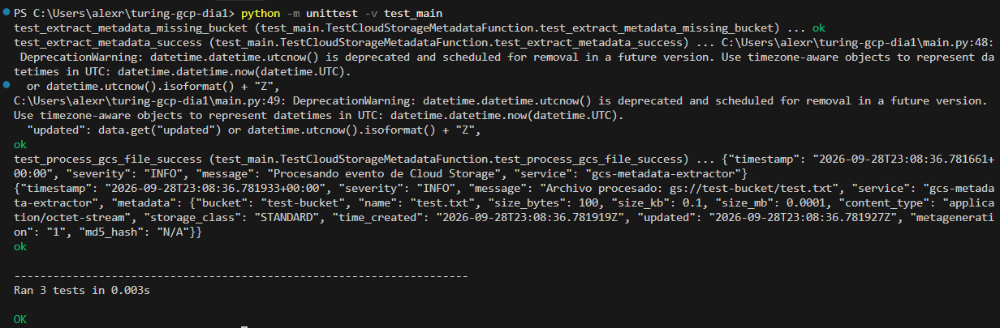

# Turing IA - Periodo de Prueba GCP & Workspace

## Reto Día 1: Configuración Avanzada de Infraestructura en GCP

**Candidato:** Julián Alejandro Rodríguez López  
**Fecha:** 28 de Septiembre, 2026  
**Repositorio Oficial:** [github.com/Spyker1/turing-gcp-workspace-challenge](https://github.com/Spyker1/turing-gcp-workspace-challenge)

---

## 1. Resumen de la Solución

Se diseñó e implementó un pipeline serverless desacoplado y orientado a eventos en Google Cloud Platform (GCP). El sistema extrae metadatos de archivos depositados en Cloud Storage, emite logs estructurados en JSON hacia Cloud Logging y aplica el principio de mínimo privilegio en IAM.

> **Nota de Entorno:** Dado que el proceso se desarrolló en un entorno de pruebas sin cuenta de facturación corporativa asignada, la solución se estructuró bajo el paradigma de **Infraestructura como Código (IaC)** reproducible (`setup_infrastructure.sh`) y la lógica de negocio fue validada al 100% mediante emulación local con la suite de pruebas unitarias (`unittest`).

---

## 2. Diagrama de Arquitectura

```text
[Productor / Ingestor]
          │ (Upload: CSV / PDF / Datasets)
          ▼
[Cloud Storage Bucket: gs://turing-storage-data]
   ├── Reglas de Ciclo de Vida: Nearline (30d) -> Coldline (90d) -> Delete (365d)
   └── Seguridad: Uniform Bucket-Level Access (UBLA) + IAM Mínimo Privilegio
          │
          ▼ Evento GCS: google.cloud.storage.object.v1.finalized
[Eventarc / Trigger]
          │
          ▼ CloudEvent Payload (JSON)
[Cloud Function Gen 2: gcs-metadata-extractor (Python 3.11)]
   ├── Service Account: sa-storage-processor (roles/logging.logWriter, roles/storage.objectViewer)
   ├── Extracción: bucket, name, size (Bytes/KB/MB), contentType, md5, timestamps
   └── Manejo robusto de errores y fallbacks seguros
          │
          ▼ JSON Structured Payload
[Google Cloud Logging] ──► Logs Explorer & Auditoría
```

---

## 3. Matriz de Seguridad y Mínimo Privilegio (IAM)

| Identidad | Rol IAM Asignado | Justificación de Seguridad |
|---|---|---|
| `sa-storage-processor` | `roles/logging.logWriter` | Permite exclusivamente emitir registros estructurados hacia Cloud Logging. |
| `sa-storage-processor` | `roles/storage.objectViewer` | Lectura de metadatos de los objetos entrantes sin permisos de borrado. |
| `user-test-ingestor` | `roles/storage.objectCreator` | Simula un cliente externo que solo puede cargar archivos al bucket. |

---

## 4. Políticas de Ciclo de Vida (`lifecycle.json`)

| Condición | Acción | Propósito / Ahorro |
|---|---|---|
| Objetos en prefijo `raw/` con antigüedad > 30 días | Pasar a `NEARLINE` | Ahorro del ~50% en costo de almacenamiento por GB. |
| Cualquier objeto con antigüedad > 90 días | Pasar a `COLDLINE` | Ahorro del ~75% para copias de respaldo históricas. |
| Objetos con antigüedad > 365 días (1 año) | `Delete` (Eliminación) | Cumplimiento normativo y limpieza de datos obsoletos. |

---

## 5. Validación Local y Pruebas Unitarias

Para ejecutar la suite de pruebas automatizadas:

```bash
python -m unittest -v test_main
```

**Resultado:** Cobertura de flujos exitosos, ausencia de campos obligatorios y emisión de logs JSON.



---

## 6. Despliegue Automatizado en Producción / Staging

Para desplegar la infraestructura en un proyecto de GCP con facturación activa:

```bash
chmod +x setup_infrastructure.sh
./setup_infrastructure.sh
```