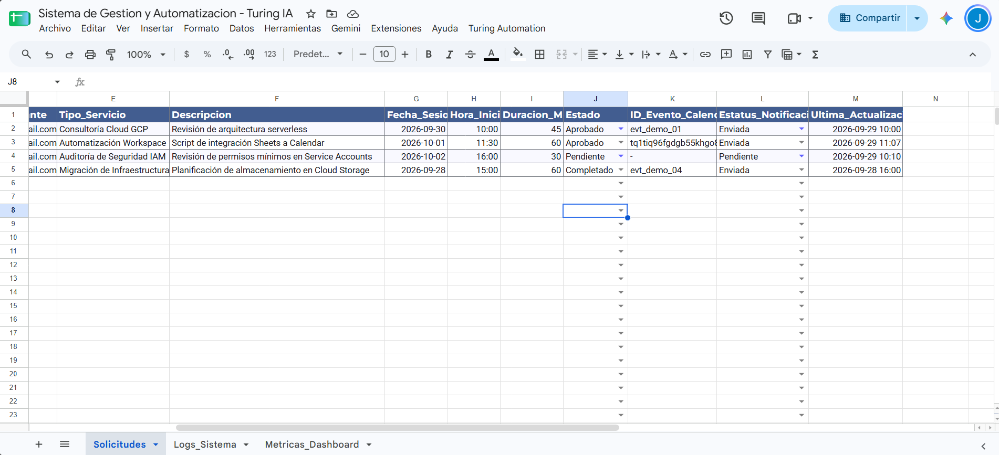
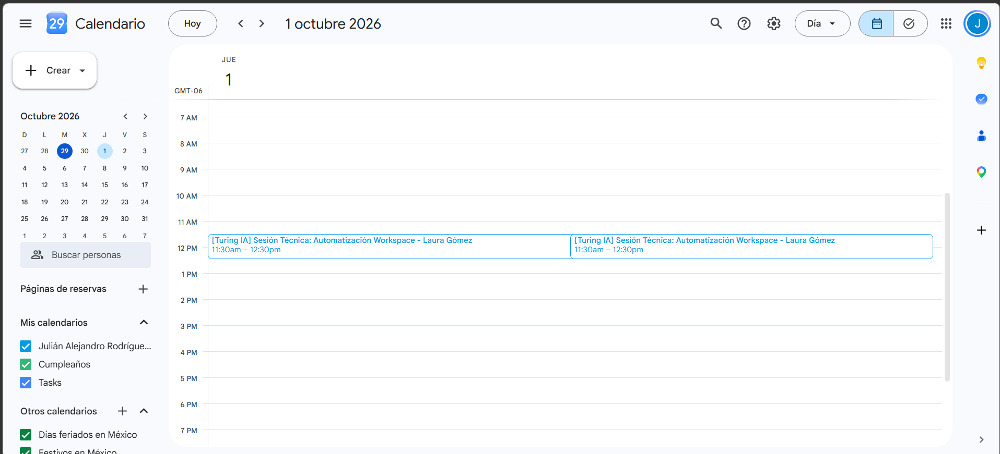
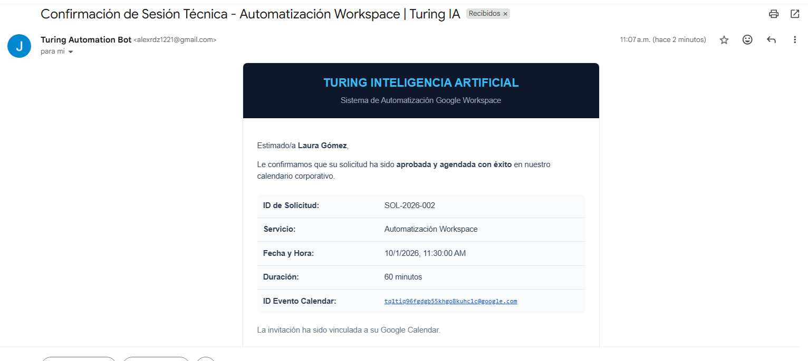
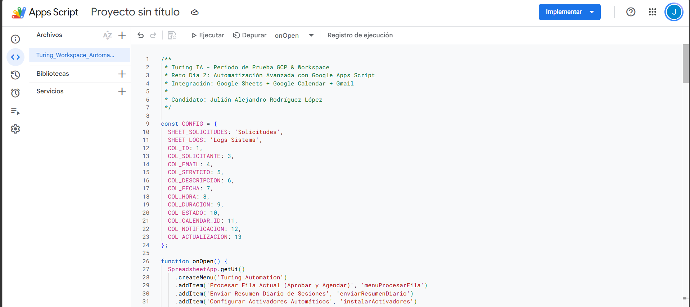

# Día 2: Automatización y Personalización en Google Workspace
## Sistema de Gestión y Notificaciones (Google Apps Script)

**Candidato:** Julián Alejandro Rodríguez López  
**Fecha:** 29 de Septiembre, 2026  
**Hoja de Cálculo:** [Sistema de Gestion y Automatizacion - Turing IA](https://docs.google.com/spreadsheets/d/17NX1gdtXOQIGud0CftnihFcsmX2U-tyvmbQDEy4XXYU/edit)

---

### 1. Flujo de Automatización
Al cambiar el estado de una solicitud a **"Aprobado"** en Google Sheets:
1. Se calcula la fecha y hora de la sesión técnica.
2. Se agenda automáticamente la reunión en **Google Calendar** y se genera el Event ID.
3. Se envía un correo de confirmación con diseño responsivo en HTML mediante **GmailApp**.
4. Se actualizan las columnas de trazabilidad en la hoja y se emiten registros en la pestaña `Logs_Sistema`.

---

### 2. Evidencias de Ejecución en Vivo

#### A. Base de Datos en Google Sheets (Fila Aprobada y Sincronizada)

#### B. Evento Creado en Google Calendar

#### C. Correo de Confirmación en Gmail (Plantilla HTML)

#### D. Código en Google Apps Script
