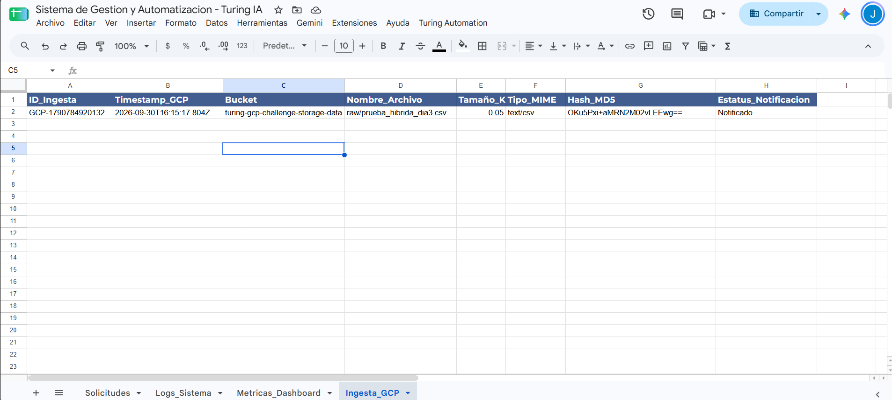
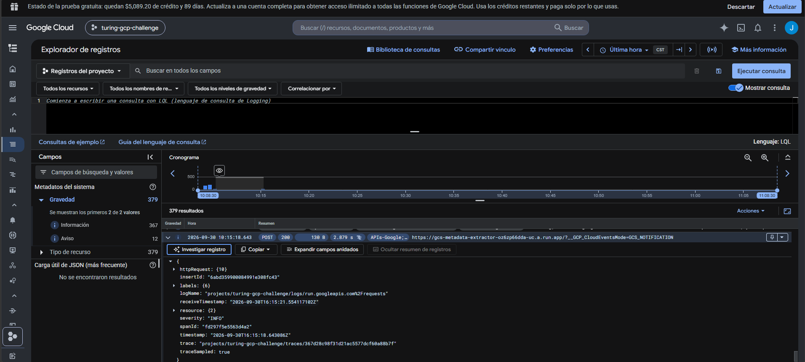
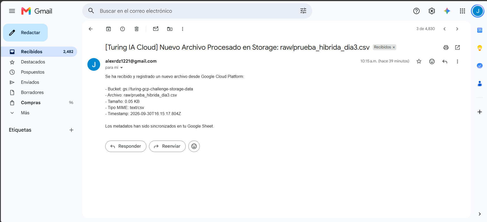
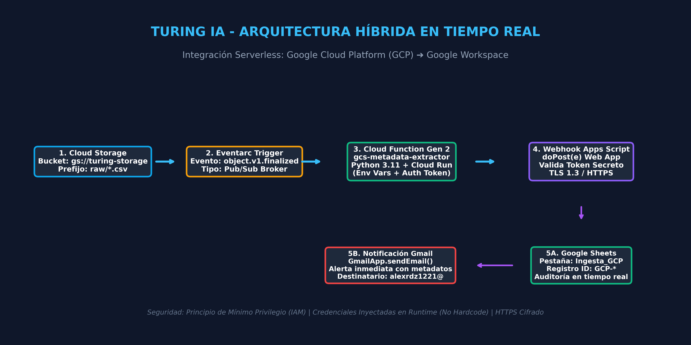

# Día 3: Integración Completa, Seguridad y Despliegue en Producción

## Arquitectura Híbrida: Google Cloud Platform (GCP) ➔ Google Workspace

**Candidato:** Julián Alejandro Rodríguez López  
**Fecha:** 30 de Septiembre, 2026  
**Proyecto GCP:** `turing-gcp-challenge` (Región: `us-central1`)  
**Hoja de Sincronización:** [Sistema de Gestion y Automatizacion - Turing IA](https://docs.google.com/spreadsheets/d/17NX1gdtXOQIGud0CftnihFcsmX2U-tyvmbQDEy4XXYU/edit)

---

## 1. Diagrama de Arquitectura del Sistema Integrado

```text
[Usuario / Ingestor Externo]
            │ (Upload archivo: raw/prueba_hibrida_dia3.csv)
            ▼
[Cloud Storage: gs://turing-gcp-challenge-storage-data]
            │
            ▼ Evento reactivo: google.cloud.storage.object.v1.finalized
[Eventarc Trigger: gcs-metadata-extractor-051241]
            │
            ▼ CloudEvent Payload (JSON)
[Cloud Function Gen 2: gcs-metadata-extractor (Python 3.11)]
            │ 1. Extracción de metadatos (tamaño, tipo MIME, hash MD5, timestamps)
            │ 2. Registro estructurado en Cloud Logging (Severity: INFO)
            │ 3. Petición POST HTTPS con autenticación por Token
            ▼
[Webhook Seguro: Google Apps Script Web App (doPost)]
            │ 1. Validación estricta de token secreto (TURING_WORKSPACE_2026_SECURE_TOKEN)
            │ 2. Control de esquema JSON y prevención de fallos
            ├──► Inserción en Google Sheets: Pestaña 'Ingesta_GCP' (ID: GCP-1790784920132)
            ├──► Notificación por Gmail: Correo dinámico a alexrdz1221@gmail.com
            └──► Auditoría del Sistema: Registro en pestaña 'Logs_Sistema'
```

---

## 2. Flujo de Integración Extremo a Extremo

1. **Ingesta Reactiva en GCP:** Al depositarse un archivo en la ruta `raw/` de Cloud Storage, Eventarc captura el evento `object.v1.finalized` y lo canaliza hacia la Cloud Function Gen 2.
2. **Extracción y Validación:** La función en Python 3.11 normaliza las dimensiones (Bytes, KB, MB), tipo MIME y hash criptográfico MD5.
3. **Comunicación Segura por Webhook:** Mediante `urllib.request`, la función transmite la carga JSON a la URL de Apps Script autorizándose con el header `token`.
4. **Persistencia y Notificación:** Apps Script valida la firma, genera el identificador único `GCP-*`, escribe la fila en la pestaña `Ingesta_GCP` y despacha un correo de confirmación vía `GmailApp`.

---

## 3. Matriz de Seguridad y Gestión de Credenciales

| Componente | Mecanismo de Seguridad | Justificación Técnica |
|---|---|---|
| Cloud Function | Variables de Entorno (`--set-env-vars`) | Se eliminó el hardcoding de URLs y tokens en código fuente público. |
| Service Account | `sa-storage-processor` (Mínimo Privilegio) | Permisos estrictos de lectura y emisión de logs sin privilegios de administración. |
| Apps Script Endpoint | Autenticación por Token Secreto | Rechazo inmediato de peticiones no autorizadas (`status: unauthorized`). |
| Canal de Transporte | Cifrado HTTPS (TLS 1.3) | Cifrado de extremo a extremo en tránsito entre GCP y Workspace. |

---

## 4. Evidencias de Ejecución en Vivo

### A. Ingesta Automática en Google Sheets (`Ingesta_GCP`)



### B. Registro en Cloud Logging (Ejecución Exitosa POST 200)



### C. Notificación Recibida en Gmail



---

## 5. Estructura de Archivos del Módulo

- `main.py`: Función serverless en Python con integración de webhook HTTPS y manejo de excepciones.
- `Webhook.gs`: Script de Google Apps Script con endpoint `doPost(e)`, validación de tokens y persistencia en Sheets.
- `requirements.txt`: Dependencias del entorno de ejecución serverless.


